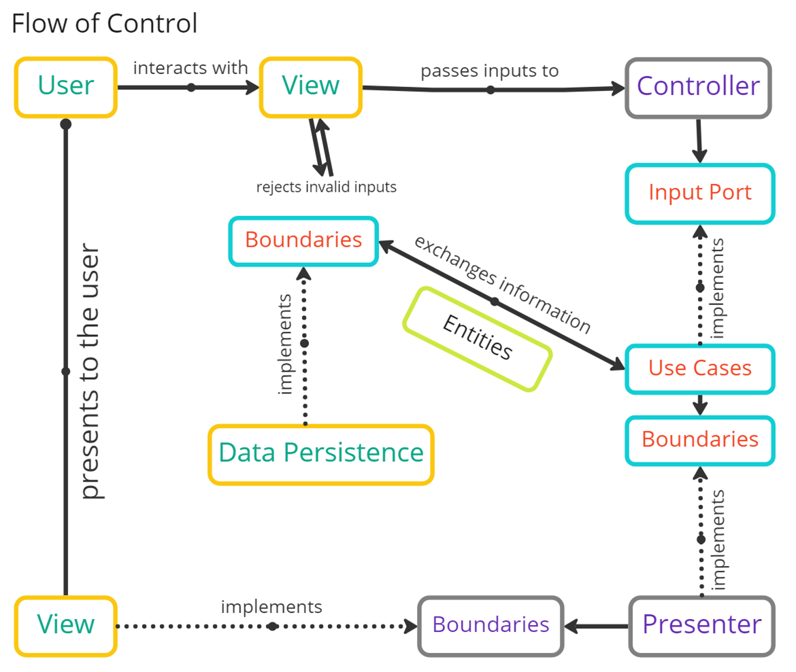

# Bill Gates - Your next Bill Management System

- This software serves as the project for the course CSC207 at the University of Toronto.

- **Distribution without permission is strongly prohibited**

# Final Presentation

- Here is the [link](https://utoronto-my.sharepoint.com/:p:/g/personal/scott_cui_mail_utoronto_ca/EaNCM-AuGAxLndhFiNJ-MIEBdH_ihSm2f20GNEqeOrXTew?e=fpbJAZ) referring to our presentation slides.
- We have clear job distributions for each group member and repetitively rehearsed few times.

# Functionalities and Specifications

- Our application will utilize a fully implemented Swing GUI, 
where users can log in to the application and start recording bill entries into the database.
- Users will be able to obtain simple statistics on the current entries recorded in the bill.
- Within each recorded bill entry, users can provide additional details on the payment. 
- Users can also utilize this application to record a split bill with other people.

# Code Organization

- We mainly organized our code by layers. However, we also split some "big" layers into fractions by responsibility.
- Package `database` contains the classes we implemented to interact with the database. This is an example where we split the Framework & Drivers layer.
- Package `entities` contains all the entities we designed.
- Package `use_cases` contains different use cases. We decided to include all parts of a use case (regardless of layers) in the same package to make the organization cleaner.
- Package `interface_adapters` are some universal classes in the interface adapters layer.
- Package `view` contains classes for a presenting our program. We implemented a GUI using Swing.
- The `Main` class is the entry point of our program. It initializes every detail (like use case initializations) of our program and connect them together.

# Test Coverage

Currently, we have implemented the following test suit:

```
MySQLDatabaseGatewayTests
- testCreateUsersTable
- testGetUserData
- testCreateBillTable
- testCreateSplitBillTable
- testInsertUser
- testInsertEntryAllAttributes
- testInsertEntryMainAttributes
- testInsertEntryAutoIncrement
- testGetEntry
- testGetBillDataAll
- testGetBillDataPartial
- testModifyEntryDescription
- testModifyEntryValue
- testModifyEntryDate
- testModifyEntryAll
- testDeleteEntry

AlterEntryUseCaseTests
- testAlterEntryLocation
- testAlterEntryValue

BillUpdateUseCaseTests
- testEmptyBill
- testRandomBill
- testRandomSplitterBill

DeleteEntryUseCaseTests
- testOneEntryDeleted
- testMultipleEntriesDeleted

InsertEntryUseCaseTests
- testNormalEntry
- testSplitterEntry

UserJoinUseCaseTests
- testRegisterNewUser
- testLoginExistingUser
- testWrongPasswordForLogin
```

# Code Style and Documentation

- The whole project completely follows a good and health convention. The readability of our codes are great. Some examples are
    - We used `lowerCamelCase` for variable and method names.
    - We used `CONSTANT_CASE` for `static final` constants.
    - We used `CamelCase` for class names.
    - We added `this.` before referring every instance variable and method.
- We also added many java docs for most of the project. 
    - For each classes, we clearly labeled the layer of in Clean Architecture, the author of, the related collaborators, and the description of this class.
    - For most methods that need a complete java doc, we added clear explanations of what the method is doing and related resources to check.
    - For most instance variables, we also added many java docs to make sure others understand their meaning.
- We have managed to eliminate most warnings from IntelliJ Idea. For those warnings that are not necessary to eliminate, we have clearly documented them.

# Use of GitHub Features

## Discussion

- It is used as a discussion board to discuss some of the features under develop. 
- However, it is mainly used as a Announcement Board, where we display all the Milestones and their respective files for the team members. 

## Issues

- We have utilized issues in conjunction with pull requests. 
- For each bug fix, feature request, or other improvements, we firstly submit an issue to outline the need to fix this problem and an initial solution of the problem, and then start working on the problem. We distributed assignees to ensure that there are no conflicts in collaboration. We also utilized labels and projects to better mange our progress and works.
- After getting done with some codes and completing a draft, we will make a pull request about this. The pull request will be connected to the issue.
- Then, after merging the pull request into main, the issue will be automatically closed.

## Pull Request

- In addition to what we mentioned in the Issues section, we all participated in reviewing the changes of each other and left many useful comments. This largely helped the growth of our project.

## Project

- Our project keeps track of our work progress so far. 
- We utilized the project to ensure better efficiency.

## Actions

### Auto Grading: Running Tests

- By default, the GitHub classroom checks does not work normally with Java 17 and the version of Gradle that we chose to use. 
- Therefore, we have managed to modify `build.gradle` to allow tests to be ran when we build it using GitHub Actions. 

### Auto Release: Create Releases

- We have also created another script, which automatically builds the JAR file and creates the release within the repository. 
- With this script, right after we are prepared with a proper release, we can modify the `gradle.yml` file to allow the repository to build itself and upload a release.  

# Design Patterns

## `User`: Singleton

- The `User` class represents a user entity in our program. 
- Only **ONE** user (Singleton) is allowed in a single runtime of our program.
- The `UserJoinUseCase` will initialize the user by calling `createInstance` with parameters.
- Then, all the use cases can use `getInstance` without parameters to obtain the current user via Singleton design pattern.

## `DatabaseGateway`: Strategy

- We have laid out this class as a collection of methods that can be implemented by different classes.
- For each specific database type (MariaDB, MongoDB, MySQL, etc.), we can implement the `DatabaseGateway` using different syntax to adapt.
- Currently, our project uses `MySQL`, therefore, `MySQLDatabaseGateway` is a specific "strategy" to connect the application to our database.

## `EntryBuilder`: Builder

- The instance variables define the default values for each attribute.
- We can build our desired `Entry` by calling the `set___` methods to give values for the entry.
- After we are done, we can call `buildEntry` or `buildSplitterEntry` to obtain the desired Entry.
- In a sense, we are "building" the entry by giving it attributes one by one. 

# Clean Architecture

- As we mentioned in the Code Organization section, we organized our code by layers in Clean Architecture. Therefore, it is easy to observe that our codes completely follow the Clean Architecture.
- We implemented the MVC architecture in the Clean Architecture. Here is the diagram of the flow of control of our program.

# SOLID

1. **Single Responsibility Principle**: Every class in our project has only one responsibility. For example, 
    - each controller is only responsible for constructing the request model for each use case,
    - each use case is only responsible for processing the request model into the response model,
    - each presenter is only responsible for converting the response model into a GUI friendly view model, and 
    - each view is only responsible for its own part of display.
2. **Open and Closed Principle**: We completely adhere this principle. 
    - For example, we have various input ports, and those input ports are simply interfaces to decouple the controller and the use case implementation of each use case. We can easily add another implementation of the use case by implementing the input port interface, without needing to change any other codes.
    - Also, we can easily add another implementation of data persistence by implementing the database boundaries. Our codes are open for extending but closed for modifications.
3. **Liskov Substitution Principle**: Our subclasses do not alter the behavior of the general inherited behavior. Therefore, we can safely substitute objects of the super classes by the subclasses.
4. **Interface Segregation Principle**: All interfaces in our projects have clearly defined specifications and any subset of the interfaces can not support the normal life cycle of our program. Therefore, we made interfaces into separate, small, concise, but necessary parts. Client codes won't be forced to implement the parts they don't need.
5. **Dependency Inversion Principle**: As we explained in the Clean Architecture section, our codes completely follow the Clean Architecture principles, and we have a bunch of boundaries separating different layers and doing dependency inversions. Therefore, we followed this principle automatically.

# Standards

## Database Standards

### Related issues 
- [#11 [Feature 7] Design and Implement Bill Splitter](https://github.com/CSC207-2022F-UofT/course-project-bill-gates/issues/11) 
- [#22 [Improvement 1] Database Specification](https://github.com/CSC207-2022F-UofT/course-project-bill-gates/issues/22)
- [#80 [Feature] Add support for adding a splitter entry](https://github.com/CSC207-2022F-UofT/course-project-bill-gates/issues/80)
- [#91 [Feature] Add a use case to fill in the inherited attributes of a splitter entry automatically](https://github.com/CSC207-2022F-UofT/course-project-bill-gates/issues/91)

### The User Table

- Table Name: `users`.

Table Specifications:

| Column Name | Data Type     | Notes                                 |
|-------------|---------------|---------------------------------------|
| `user_id`   | `INT`         |                                       |
| `user_name` | `VARCHAR(10)` | The max user name length is 10        |
| `password`  | `VARCHAR(16)` | The max password length is 16         |
| `bill_id`   | `INT`         | This is the main bill id of this user |

### The Main Bill Table

- Table Name: `bill_{bill_id}`.

- Side Note: `bill_id = user_id`. Any user has only main bill.

Table Specifications:

| Column Name     | Data Type        | Notes                                                                                  |
|-----------------|------------------|----------------------------------------------------------------------------------------|
| `entry_id`      | `INT`            |                                                                                        |
| `date`          | `TIMESTAMP`      |                                                                                        |
| `value`         | `DECIMAL(16, 2)` | We expect `value` to have 16 integer places and 2 decimal places                       |
| `currency`      | `CHAR(3)`        | As defined in ISO 4217, currency codes all have a length of 3                          |
| `description`   | `TEXT`           |                                                                                        |
| `from`          | `TEXT`           |                                                                                        |
| `to`            | `TEXT`           |                                                                                        |
| `location`      | `TEXT`           |                                                                                        |
| `split_bill_id` | `INT`            | The splitter bill id associated with this entry. We define `entry_id = split_bill_id`. |

### The Splitter Bill Table

- Table Name: `bill_{main_bill_id}_{splitter_bill_id}`.

- Side Note: `bill_id = user_id`. Any user has only main bill. `splitter_bill_id = entry_id`. Any entry has only one splitter bill.

Table Specifications:

| Column Name   | Data Type        | Notes                                                            |
|---------------|------------------|------------------------------------------------------------------|
| `entry_id`    | `INT`            |                                                                  |
| `date`        | `TIMESTAMP`      | Inherited from the parent entry.                                 |
| `value`       | `DECIMAL(16, 2)` | We expect `value` to have 16 integer places and 2 decimal places |
| `currency`    | `CHAR(3)`        | Inherited from the parent entry.                                 |
| `description` | `TEXT`           |                                                                  |
| `from`        | `TEXT`           | Inherited from the parent entry.                                 |
| `to`          | `TEXT`           | Inherited from the parent entry.                                 |
| `location`    | `TEXT`           | Inherited from the parent entry.                                 |
| `payee`       | `TEXT`           | This represents the person who is responsible for this split.    |
| `paid_back`   | `BOOLEAN`        | This represents whether the payee had paid the money back.       |

- Related Use Case and Details

    - Since we want to replace the entries directly, we may want to call `BillUpdateUseCase`.

    - We will set the `currentBill` in the `User` class as this bill id.

    - Every time we clicked the "Back" button, we just change the `currentBill` to the bill id of the main bill of this user, and then call `BillUpdateUseCase`.

## Cloud Standards

### Related issue

- [#25 [Feature 8] Cloud Storage](https://github.com/CSC207-2022F-UofT/course-project-bill-gates/issues/25)

### Connection details
```
hostname=bill-gates-database.mysql.database.azure.com
username=scott
password=Billgates@
ssl-mode=require
```

- Database Name: `bill`.

## Use Case Standards

#### User Join Use Case

- This use case will initialize the `User` instance.

# About Us

We are the group "Bill Gates" and we are developing the software "Bill Gates".

We hope that you can be the next Bill Gates with the help of "Bill Gates".

Group Members:

- Brandon Fu [Yuhan-Ut](https://github.com/Yuhan-Ut)
- Charlotte Chen [CharlotteChenyy](https://github.com/CharlotteChenyy)
- Ellen Zhang [Ellen141319](https://github.com/Ellen141319)
- Eva Dai [eevadai](https://github.com/eevadai)
- Ray Hung [Lei-Tin](https://github.com/Lei-Tin)
- Ruby Li [Yunshan-522](https://github.com/Yunshan-522)
- Scott Cui [ScottCTD](https://github.com/ScottCTD)
- Xinxiang Gao [xgao28](https://github.com/xgao28)
